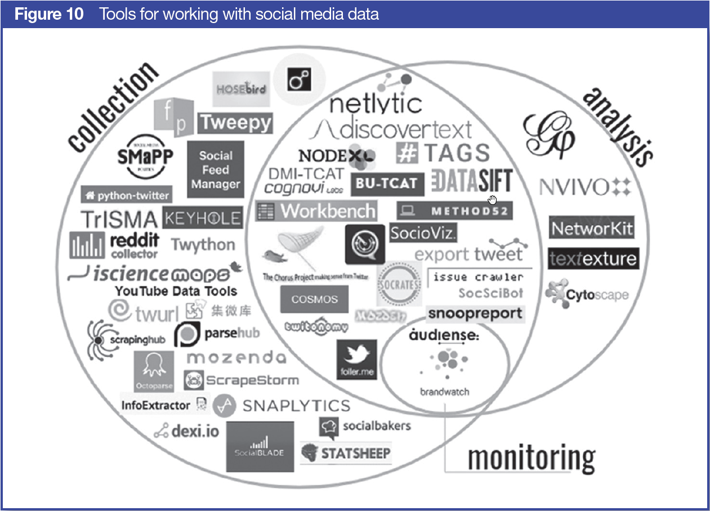

### Tools for Social Media Research

Over 30% of the world's population uses social media. We spend a vast
number of hours attached to our devices; [every minute in the United
States, 2.1 million snaps are created on Snapchat and one million people
log in to Facebook](https://www.statista.com/topics/1164/social-networks/). This use generates an enormous
amount of data about our behavior, opinions, and preferences. Some of
this data can be collected and explored, not only for research purposes
but also for insights that can help companies sell to or influence
people. For example, even [fast food chains are no longer waiting for
their customers to complain but are parsing social media posts to
pinpoint the location of restaurants that are likely to have caused
food-borne disease](https://venturebeat.com/2019/05/23/chick-fil-as-ai-can-spot-signs-of-foodborne-illness-from-social-media-posts-with-78-accuracy/).

Given that there is interest in this data from those conducting both
academic and consumer research, a great quantity of tools (full apps,
wrappers, or pieces of code) is available to explore social media data.
At the time of writing, we have found and reviewed 104 tools that we
know researchers have used (see Figure 10). Close to 70% of the tools
(70 out of 104) interface with Twitter, even though this is not
considered the most popular social media platform, with far fewer
monthly users than Facebook or Instagram (*Just over 300 million monthly users in 2019, compared to two billion on Facebook and one billion on Instagram, for more details check [statista](https://www.statista.com/statistics/272014/global-social-networks-ranked-by-number-of-users/)*). We believe this is because
it is much easier to access data from Twitter through their application
programme interface (API) than from other platforms.

Generally, social media platforms have a policy against using their API
for research purposes. This is true for LinkedIn and Facebook. However,
the spread of misinformation has driven Facebook to enable access to
their data for research purposes. In 2018, together with a number of
partners, Facebook set up [Social Science One](https://socialscience.one/), a nonprofit
organisation led by a group of senior researchers from around the world
who selected and gave grants to 12 teams of researchers to work with
Facebook data. A couple of years earlier, and now on their second round
of research programmes, LinkedIn set up the [Economic Graph Research
Program](https://engineering.linkedin.com/teams/data/projects/economic-graph-research) to enable researchers to access and work with their
data.

More than half (56) of the social media tools we identified are either
free apps or open source packages on GitHub, and 10 have limited free
functionality. One tool that particularly caught our attention is
DocNow, developed by Shift Design and a group of researchers at the
University of Maryland and the University of Virginia, and funded by the
Andrew W. Mellon Foundation. [DocNow](https://www.docnow.io/) provides a collection of tools
that respond to the role of social media in reporting historically
significant events, or "documenting the now." Prioritising ethical
collection, use, and preservation of social media data in academic
research, their crowd- sourced catalog of tweet ID datasets and
["rehydration" tool](https://medium.com/on-archivy/on-forgetting-e01a2b95272) allow access to historical tweets, whilst
ensuring they are used in line with the creator's decisions.

We published a series of blog posts in 2019 with more insights from our research:

+ [A review of the current landscape of social media tools and the labs involved in developing them](https://ocean.sagepub.com/blog/social-media-data-in-research-a-review-of-the-current-landscape)

+ [How researchers are using LinkedIn data](https://ocean.sagepub.com/blog/social-scientists-working-with-linkedin-data)

+ [How researchers are using Weibo data](https://ocean.sagepub.com/blog/how-researchers-around-the-world-are-making-use-of-weibo-data)

+ [Tips on collecting social media data for research](https://ocean.sagepub.com/blog/collecting-social-media-data-for-research)

+ [Information about the teams given access to Facebook data through
Social Science One](https://ocean.sagepub.com/blog/researchers-are-awarded-grants-to-study-facebook-data-and-its-influence-on-elections)
