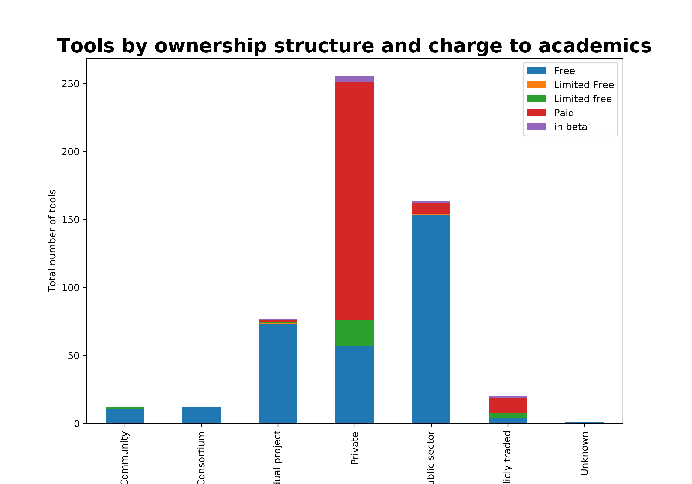

+ [Overview](#overview) of tools for social science research
+ [Key takeaways](#key-takeaways), reviewing 500+ tools

## Overview

Since the publication of our [whitepaper](https://uk.sagepub.com/en-gb/eur/technologies-for-social-science-research) in the fall of 2019, we\'92ve added almost 100 more tools to our list. In this post, we will be updating the key figures from the paper.

## Key takeaways

There is a growing number of tools and technologies for social science research, both developed by academics, as well as from the private sector. The large majority are still coming out of the US and UK.

Our sample of tools covers mostly those focused on text mining, social media, qualitative data analysis and annotation of text and images, data visualization and surveying.

There are about as many free as there are paid-for, or limited free tools available.

The number of tools that are developed by diverse teams (in this case teams that include at least one woman), is still small, and not necessarily growing. The data is based on 411 tools for which we could find leadership information.

In terms of the organizational structure behind the tools, the breakdown is similar to what we noted in the whitepaper.

